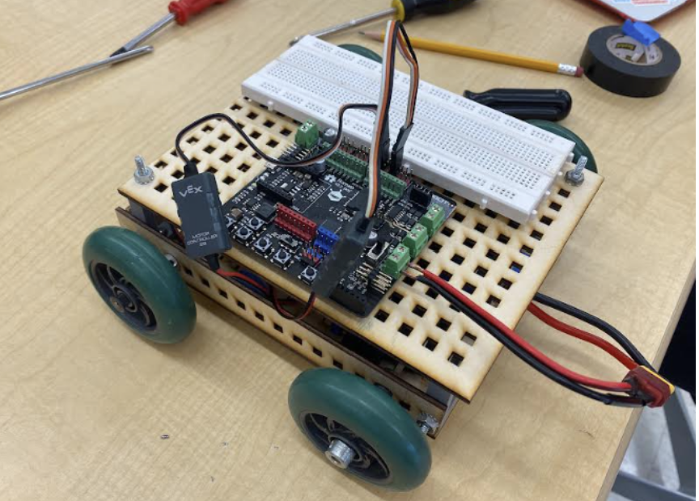
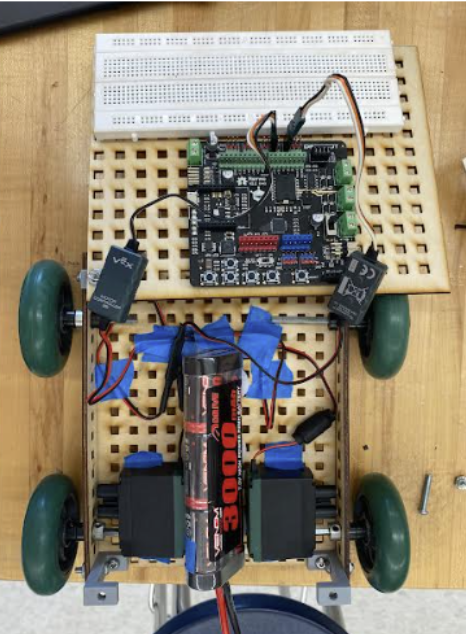
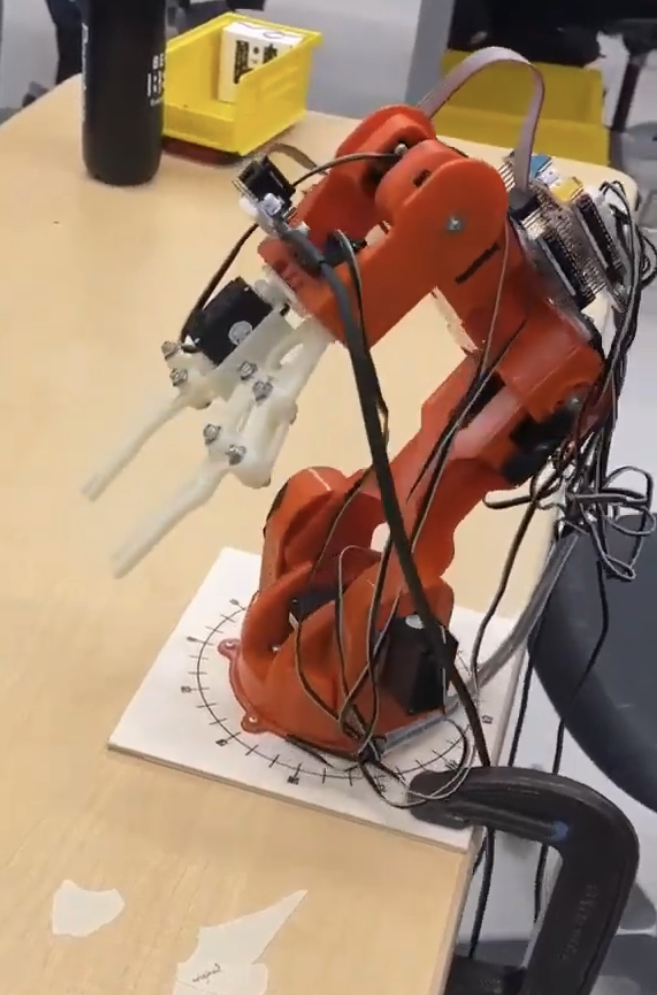

# Robot Project

Designed and built a robot using CAD, laser cutting, and 3D printing. Programmed the robot using the Arduino IDE and C++ to do a figure eight, detect and move towards light, and navigate around obstacles. Programmed a robotic arm to detect an object based on color and size using Pixymon and pick the object up and place it at a specified location. 

## Robot Images

## Robotic Arm Image

